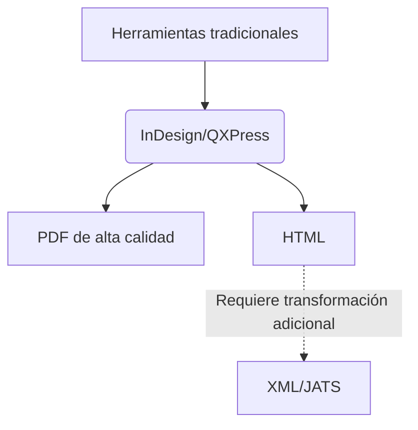

# ¿Por qué las revistas científicas privilegian el PDF sobre el HTML?  

---

## Índice  
1. [Introducción](#introducción)  
2. [Factores técnicos y culturales](#factores-técnicos-y-culturales)  
3. [Barreras humanas y laborales](#barreras-humanas-y-laborales)  
4. [El desafío de la edición ramificada](#el-desafío-de-la-edición-ramificada)  
5. [Propuestas de cambio](#propuestas-de-cambio)  
6. [Conclusión](#conclusión)  
7. [Referencias](#referencias)  

---  

## Introducción  
El formato PDF domina la comunicación científica pese a las ventajas del HTML (accesibilidad, enlazado semántico, dinamismo). Este trabajo intenta analizar las posibles causas de esta persistencia, explorando:  
- **Factores estructurales** (técnicos, económicos).  
- **Resistencias humanas** (editores, autores, diseñadores).  
- **El conflicto con modelos emergentes** (edición ramificada).  

**Hipótesis**:  
*La preferencia por el PDF no se debe a su superioridad técnica, sino a inercias institucionales y a la falta de incentivos para adoptar flujos de trabajo modernos.*  

---  

## Factores técnicos y culturales  

### 1. Inercia del sistema académico  
- **Símbolo de autoridad**: El PDF replica la estética del papel, asociada a rigor («documento definitivo»).  
- **Compatibilidad**: Es universalmente legible, incluso con contenido complejo (fórmulas matemáticas en LaTeX).  



### 2. Limitaciones económicas  
- Migrar a HTML exigiría:  
  - Inversión en nuevas plataformas.  
  - Capacitación en estándares semánticos (W3C, MathML, WCAG).  

---  

## Barreras humanas y laborales  

### 1. Roles clave y sus resistencias  
| **Rol**           | **Dolor principal**                  | **Ejemplo**                          |  
|--------------------|--------------------------------------|--------------------------------------|  
| Editores           | Miedo a perder control editorial     | ¿Cómo citar versiones dinámicas?   |  
| Diseñadores        | Dominio de herramientas para PDF     | Adobe InDesign vs. CSS/HTML          |  
| Autores senior     | Desconfianza hacia formatos «dinámicos»  | Prefiero revisar pruebas en PDF    |  

### 2. Formación profesional  
- Los programas de edición científica rara vez incluyen:  
  - HTML semántico.  
  - Gestión de repositorios Git.  

---  

## El desafío de la edición ramificada  

### 1. ¿Qué es?  
Modelo donde los artículos se actualizan constantemente (como en GitHub), en lugar de publicarse como «versiones finales».  

### 2. Conflictos con el PDF  
| **Parámetro**       | **PDF**               | **Edición ramificada**         |  
|----------------------|-----------------------|--------------------------------|  
| Actualizaciones      | Bloqueadas            | Continuas (commits)            |  
| Colaboración         | Limitada              | En tiempo real                 |  
| Ejemplo             | Nature, Science       | Distill.pub, Living Reviews    |  

**Barrera clave**: Los sistemas de indexación (Scopus, WoS) no admiten DOIs versionados.  

---  

## Propuestas de cambio  

### 1. Para instituciones  
- Exigir HTML accesible en políticas de ciencia abierta.  
- Valorar métricas alternativas (ej: contribuciones en Git).  

### 2. Para revistas  
- Adoptar herramientas híbridas:  
  ```mermaid  
  pie  
      title Flujo de trabajo ideal  
      "Autor escribe en Markdown" : 40  
      "Genera PDF y HTML automáticamente" : 30  
      "Publica en repositorio versionado" : 30  
  ```  

### 3. Para autores  
- Demandar plataformas que soporten:  
  - Versionamiento.  
  - Visualización responsive (HTML > PDF en móviles).  

---  

## Conclusión  
El PDF persiste por una **combinación de factores técnicos, inercias laborales y falta de alineación en el ecosistema académico**.

Sin embargo:  
- **El HTML es técnicamente superior** para la ciencia colaborativa.  
- **El cambio requerirá intervenciones simultáneas**:  
  1. Capacitación de editores y diseñadores.  
  2. Adaptación de sistemas de evaluación.  
  3. Desarrollo de herramientas que simplifiquen la transición.  

> *"El futuro de la comunicación científica no cabe en un PDF."*  

